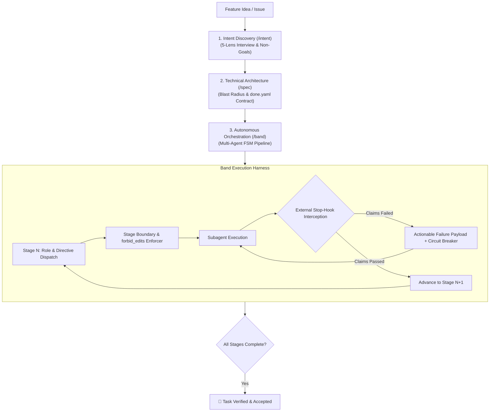

# 🥁 Band

> **Declarative, Claims-Driven Agent Harness & Verification FSM for Autonomous Software Engineering.**

`Band` is a lightweight, zero-dependency execution harness and external verification engine. It drives AI agents through arbitrary, declarative multi-stage pipelines (TDD, mutation analysis, adversarial audits, multi-tier quality gates) with deterministic state machines and external Stop-hook enforcement.



## 🔄 The 3-Step Autonomous Engineering Lifecycle

Band structures autonomous development into three strictly gated phases:

```
[ /intent ] ──────────────► [ /spec ] ──────────────► [ /band ]
Human & Business           Architecture & Contract     Multi-Agent FSM
• JTBD & UX flow           • Code reconnaissance       • Red-phase (Test Author)
• 5-Lens Interview         • Interface & DTO design    • Green-phase (Implementer)
• Strict Non-Goals         • Blast radius matrix       • Mutation analysis (Diff)
• Zero Code / Zero Leaks   • done.yaml Claims          • Adversarial review
• Validator Gate           • Validator Gate            • Stop-Hook Gatekeeper
```

### 1. Intent Discovery (`/intent`)
* **Purpose:** Defines **why** the task is needed, **what** user/business problem it solves, and **what is strictly out of scope**.
* **5-Lens Interview:** Clarifies JTBD, Adversarial edge cases, Non-Goals, Pre-Mortem failure modes, and Business Invariants.
* **Anti-Pollution Rule:** Strictly forbids technical design, file paths, or code snippets in the intent document.
* **Gate:** `python3 -m band --validate-intent .agents/tasks/<slug>/intent.md`

### 2. Technical Specification (`/spec`)
* **Purpose:** Transforms validated intent into an architecture blueprint and a machine-readable verification contract.
* **Reconnaissance:** Explores existing types and helpers to prevent duplicate implementations.
* **Blast Radius Matrix:** Explicitly maps affected packages, modified files, and downstream consumers.
* **Contract Generation:** Creates `.agents/tasks/<slug>/done.yaml` with declarative verification claims.
* **Gate:** `python3 -m band --validate .agents/tasks/<slug>/done.yaml`

### 3. Orchestration & Verification (`/band`)
* **Purpose:** Executes the task autonomously through specialized subagents governed by a deterministic state machine.
* **Isolation:** Enforces `forbid_edits` boundaries per stage (e.g. implementer cannot alter tests).
* **Stop-Hook Interception:** Intercepts agent exit attempts, verifies claims with real compilers and test runners, and feeds back failure traces.
* **Gate:** `python3 -m band --hook`

## 🧠 Scientific Grounding & Theoretical Foundation

Autonomous LLM agents deployed on real-world codebases exhibit predictable, mathematically well-documented failure modes when left unconstrained:

### 1. Inability of LLMs to Self-Correct Without Deterministic Oracles
* **Research:** [*Huang et al. (2023), "Large Language Models Cannot Self-Correct in Reasoning Tasks without External Feedback"*, arXiv:2310.01798](https://arxiv.org/abs/2310.01798); [*Shinn et al. (2023), "Reflexion: Language Agents with Verbal Reinforcement Learning"*, NeurIPS](https://arxiv.org/abs/2303.11366).
* **The Problem:** LLMs cannot reliably self-evaluate their own generated code through pure intrinsic reflection; they experience confirmation bias and falsely declare broken solutions correct.
* **Band Solution:** External Stop-hook executing real compilers, linters, test harnesses, and typecheckers to intercept exit attempts and return exact execution traces.

### 2. Phase Contamination & Test Modification Gaming
* **Research:** [*Jimenez et al. (2024), "SWE-bench: Can Language Models Resolve Real-World GitHub Issues?"*, ICLR](https://arxiv.org/abs/2310.06770).
* **The Problem:** In monolithic prompts, agents "game" test suites by weakening assertions, deleting failing tests, or tailoring tests to match incorrect implementations.
* **Band Solution:** Git-level `forbid_edits` boundaries per stage. A Test Author agent is isolated to test files, while an Implementer agent is forbidden from editing test files during the Green phase.

### 3. Role Specialization & Standard Operating Procedures (SOP)
* **Research:** [*Hong et al. (2023), "MetaGPT: Meta Programming for Multi-Agent Collaborative Framework"*, ICLR 2024](https://arxiv.org/abs/2308.00352); [*Wu et al. (2023), "AutoGen: Enabling Next-Gen LLM Applications"*](https://arxiv.org/abs/2308.08155).
* **The Problem:** Monolithic single-agent contexts become overloaded, degrading reasoning quality and losing track of non-functional invariants.
* **Band Solution:** Explicit multi-agent decomposition where each stage defines a specialized role (`Test Author`, `Code Implementer`, `Mutation Runner`, `Adversarial Reviewer`, `Gatekeeper`) with minimal, scoped context.

### 4. Mutation Testing as an Empirical Adequacy Criterion
* **Research:** [*Jia & Harman (2011), "An Analysis and Survey of the Development of Mutation Testing"*, IEEE TSE](https://ieeexplore.ieee.org/document/5487526).
* **The Problem:** High test coverage frequently hides vacuous assertions where tests run code without verifying critical business invariants.
* **Band Solution:** First-class `mutation` claim adapter running diff-scoped mutation testing (e.g., Stryker/PIT) to prove test suites actively catch logic mutations before code is accepted.

## 🚀 Quickstart in Any Repository

Install `Band` into the root of any repository:

```bash
curl -fsSL https://raw.githubusercontent.com/jiva-studio/band/main/install.sh | bash
```

This installs the clean `.agents/` structure:

```text
.agents/
├── hooks.json             # Stop-hook configuration
├── pipelines/             # Declarative pipeline definitions (standard, hardened, fast, docs)
├── band/                  # Python FSM verification engine & zero-dependency YAML loader
├── skills/                # Agent skills (/band, /spec, /intent, /coder)
└── tasks/                 # Task folders with intent.md, spec.md, done.yaml
```

## 📦 Defining Task Manifests (`done.yaml`)

```yaml
slug: feat-user-auth
target: "services/auth"
pipeline: "hardened"

claims:
  # L1: Build & Unit Tests
  - id: l1-build
    kind: make
    target: check-package
    params:
      PKG: "@services/auth"

  # L2: Mutation Testing (Stryker diff against modified files)
  - id: l2-mutation
    kind: mutation
    target: "@services/auth"
    mode: diff

  # L3: AI Adversarial Critic Review
  - id: l3-critic
    kind: critic
    checks:
      - "No unhandled nulls or security bypasses"
      - "Follows intent.md non-goals"

  # L4: Clean Diff Hygiene
  - id: l4-hygiene
    kind: hygiene
    no_stubs: true
    no_skipped_tests: true
```

## 🕹 CLI Reference

```bash
# Validate business intent
python3 -m band --validate-intent .agents/tasks/<slug>/intent.md

# Validate task specification contract
python3 -m band --validate .agents/tasks/<slug>/done.yaml

# Start pipeline for a task
python3 -m band --start-pipeline .agents/tasks/<slug>/done.yaml

# Inspect pipeline state
python3 -m band --status .agents/tasks/<slug>/done.yaml

# Run verification claims directly
python3 -m band --spec .agents/tasks/<slug>/done.yaml

# Execute Stop-hook check (called automatically by agent runner)
python3 -m band --hook
```

## 🧪 Self-Tests

```bash
make check
make self-test
```

## 📄 License

MIT © [Jiva Studio](https://github.com/jiva-studio)
