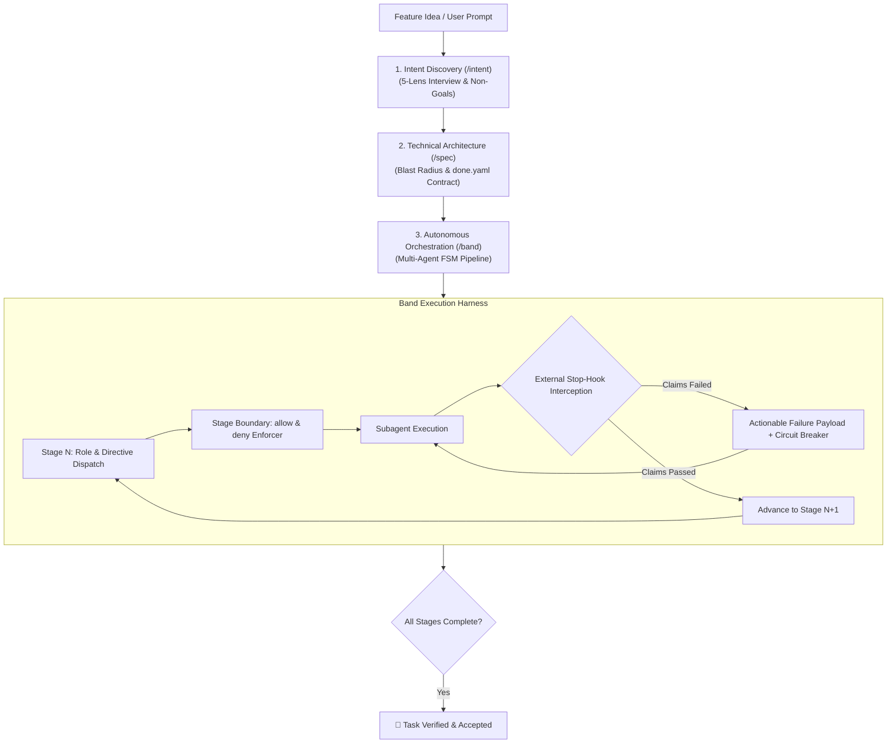
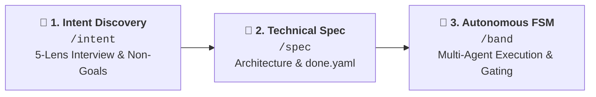

# 🥁 Band

> **Declarative, Claims-Driven Agent Harness & Verification FSM for Autonomous Software Engineering.**

`Band` is a lightweight, zero-dependency execution harness and external verification engine. It drives AI agents through arbitrary, declarative multi-stage pipelines (TDD, mutation analysis, adversarial audits, multi-tier quality gates) with deterministic state machines and external Stop-hook enforcement.



## 🔄 The 3-Step Autonomous Engineering Lifecycle

Band structures autonomous software engineering into three strictly gated phases:



| Phase | Skill | Primary Artifact | Quality Gate |
| :--- | :--- | :--- | :--- |
| **1. Intent** | `/intent` | `.agents/tasks/<slug>/intent.md` | `python3 -m band --validate-intent` (Zero code leaks, 5 lenses) |
| **2. Specification** | `/spec` | `.agents/tasks/<slug>/spec.md` + `done.yaml` | `python3 -m band --validate` (Schema, Blast Radius, Claims) |
| **3. Orchestration** | `/band` | Multi-agent code & test implementation | External Stop-hook (100% claims verified in FSM) |

### 1. Intent Discovery (`/intent`)
* **Problem Solved:** Prevents [context pollution and goal drift (Anthropic Research, 2024)](https://www.anthropic.com/research/building-effective-agents) where AI models jump into premature code assumptions before understanding the business domain.
* **5-Lens Interview:** Clarifies JTBD, Adversarial edge cases, Non-Goals, Pre-Mortem failure modes, and Business Invariants.
* **Anti-Pollution Rule:** Strictly forbids technical design, file paths, or code snippets in the intent document.
* **Gate:** `python3 -m band --validate-intent .agents/tasks/<slug>/intent.md`

### 2. Technical Specification (`/spec`)
* **Problem Solved:** Prevents [hallucinatory API design and blast-radius regressions (SWE-bench / Jimenez et al., 2024)](https://arxiv.org/abs/2310.06770) by requiring codebase reconnaissance before coding.
* **Blast Radius Matrix:** Explicitly maps affected packages, modified files, and downstream consumers.
* **Contract Generation:** Creates `.agents/tasks/<slug>/done.yaml` with declarative verification claims.
* **Gate:** `python3 -m band --validate .agents/tasks/<slug>/done.yaml`

### 3. Orchestration & Verification (`/band`)
* **Problem Solved:** Eliminates [premature task completion and self-correction failure (Huang et al., 2023)](https://arxiv.org/abs/2310.01798) by intercepting agent exits with a deterministic FSM and external Stop-hook.
* **Stage Boundaries:** Enforces `allow` (whitelist) and `deny` (blacklist) file boundaries per stage at the Git level.
* **Stop-Hook Interception:** Intercepts agent exit attempts, verifies claims with real compilers and test runners, and feeds back failure traces.
* **Gate:** Driven automatically by `.agents/hooks.json`

## 🧠 Scientific Grounding & Theoretical Foundation

Autonomous LLM agents deployed on real-world codebases exhibit predictable failure modes when left unconstrained. Band's architecture directly solves these empirical problems:

### 1. Separation of Intent from Specification (Anti-Pollution & Goal Drift)
* **The Problem:** When an AI agent is asked to simultaneously understand business requirements and write technical code, it suffers from [severe context pollution and goal drift (Anthropic Research, 2024)](https://www.anthropic.com/research/building-effective-agents): the model jumps to premature technical assumptions (e.g. ad-hoc database schemas), skips critical business edge cases, and loses sight of non-goals [without structured decomposition (Wei et al., 2022)](https://arxiv.org/abs/2201.11903).
* **Band Solution:** Two-phase decoupling via `/intent` and `/spec`. Phase 1 captures human intent, user journeys, invariants, and strict non-goals in pure natural language (zero code). Phase 2 takes the validated intent, conducts codebase reconnaissance, and outputs an exact architectural blueprint and verification contract (`done.yaml`).

### 2. Inability of LLMs to Self-Correct Without Deterministic Oracles
* **The Problem:** Empirical research shows that [LLMs cannot reliably self-evaluate or self-correct generated code through intrinsic reflection (Huang et al., 2023)](https://arxiv.org/abs/2310.01798). Without external feedback loops [like executable test oracles (Shinn et al., 2023)](https://arxiv.org/abs/2303.11366), agents experience confirmation bias and falsely declare broken solutions correct.
* **Band Solution:** External Stop-hook executing real compilers, linters, test harnesses, and typecheckers to intercept exit attempts and return exact execution traces.

### 3. Phase Contamination & Test Modification Gaming
* **The Problem:** In unconstrained monolithic prompts, AI agents frequently [game evaluations by weakening, altering, or deleting failing tests (SWE-bench / Jimenez et al., 2024)](https://arxiv.org/abs/2310.06770) to force broken implementations to pass.
* **Band Solution:** Git-level `allow` (whitelist) and `deny` (blacklist) boundaries per stage. A Test Author agent is isolated to test files, while an Implementer agent is strictly blocked from altering test suites during the Green phase.

### 4. Role Specialization & Standard Operating Procedures (SOP)
* **The Problem:** Monolithic single-agent contexts experience rapid reasoning degradation due to [context overload and loss of operational discipline (MetaGPT / Hong et al., 2023)](https://arxiv.org/abs/2308.00352); [multi-agent orchestration with dedicated roles is required to sustain long-horizon execution (AutoGen / Wu et al., 2023)](https://arxiv.org/abs/2308.08155).
* **Band Solution:** Explicit multi-agent decomposition where each stage defines a specialized role (`Test Author`, `Code Implementer`, `Mutation Runner`, `Adversarial Reviewer`, `Gatekeeper`) with minimal, scoped context.

### 5. Mutation Testing as an Empirical Adequacy Criterion
* **The Problem:** High test coverage frequently hides vacuous assertions: [tests can execute code paths without verifying critical business invariants, leaving silent logic bugs undetected (Jia & Harman, 2011)](https://ieeexplore.ieee.org/document/5487526).
* **Band Solution:** First-class `mutation` claim adapter running diff-scoped mutation testing (e.g., Stryker/PIT) to prove test suites actively catch logic mutations before code is accepted.

## 📦 Pipelines & Task Contracts

### What is a Pipeline?

A **Pipeline** (`pipelines/*.yaml`) is a declarative finite state machine (FSM) that orchestrates an engineering workflow into distinct, verifiable checkpoints:

* **Sequence of Stages:** Ordered steps from task inception to verified completion.
* **Subagent Roles & Directives:** The specific job title and instructions given to the subagent handling each stage.
* **File Boundaries (`allow` / `deny`):** Standard industry path patterns constraining what the subagent is permitted to touch (e.g. Test Authors cannot touch application source; Implementers cannot touch test files).
* **Deterministic Claims:** Machine-verifiable conditions (`make` targets, mutation score, AI reviewer checks) that MUST pass before the external Stop-hook allows advancing to the next stage.

### Built-in Pipeline Catalog

| Pipeline | Target Use Case | Stages Executed |
| :--- | :--- | :--- |
| **`hardened`** | Mission-critical core domain logic & security features | `red-phase` ➔ `green-phase` ➔ `mutation-gate` ➔ `adversarial-review` ➔ `gatekeeper` |
| **`standard`** | Regular product features and component development | `red-phase` ➔ `green-phase` ➔ `gatekeeper` |
| **`fast`** | Quick hotfixes, CSS styling, and minor UI tweaks | `implementation` ➔ `gatekeeper` |
| **`docs`** | Technical documentation, architecture guides, schemas | `authoring` ➔ `critic` ➔ `gatekeeper` |

### What is a Task Contract (`done.yaml`)?

A **Task Contract** (`.agents/tasks/<slug>/done.yaml`) is the single source of truth for task completion. It binds a specific task to a pipeline and defines the verifiable claims required for final acceptance.

```yaml
slug: feat-user-auth
target: "services/auth"
pipeline: "hardened"

claims:
  # L1: Build & Unit Tests
  - id: l1-build
    kind: make
    target: check-package
    params:
      PKG: "@services/auth"

  # L2: Mutation Testing (Stryker diff against modified files)
  - id: l2-mutation
    kind: mutation
    target: "@services/auth"
    mode: diff

  # L3: AI Adversarial Critic Review
  - id: l3-critic
    kind: critic
    checks:
      - "No unhandled nulls or security bypasses"
      - "Follows intent.md non-goals"

  # L4: Clean Diff Hygiene
  - id: l4-hygiene
    kind: hygiene
    no_stubs: true
    no_skipped_tests: true
```

## 🚀 Quickstart

Install `Band` into the root of any repository:

```bash
curl -fsSL https://raw.githubusercontent.com/jiva-studio/band/main/install.sh | bash
```

This installs the clean `.agents/` structure:

```text
.agents/
├── hooks.json             # Stop-hook configuration
├── pipelines/             # Declarative pipeline definitions (standard, hardened, fast, docs)
├── band/                  # Python FSM verification engine & zero-dependency YAML loader
├── skills/                # Agent skills (/band, /spec, /intent, /coder)
└── tasks/                 # Task folders with intent.md, spec.md, done.yaml
```

## 💬 Developer Workflow

Developers and AI agents interact naturally through slash commands in their IDE/agent chat:

1. **Discover & Lock Intent:**
   ```text
   /intent Add course cover image picker
   ```
   Conducts the 5-lens interview and produces a validated `.agents/tasks/<slug>/intent.md`.

2. **Design Architecture & Generate Contract:**
   ```text
   /spec
   ```
   Explores the codebase, drafts `.agents/tasks/<slug>/spec.md`, and generates a validated `done.yaml`.

3. **Autonomous Execution:**
   ```text
   /band
   ```
   Spawns specialized subagents through the FSM pipeline under the supervision of the external Stop-hook until all claims are 100% verified.

## 📄 License

MIT © [Jiva Studio](https://github.com/jiva-studio)
