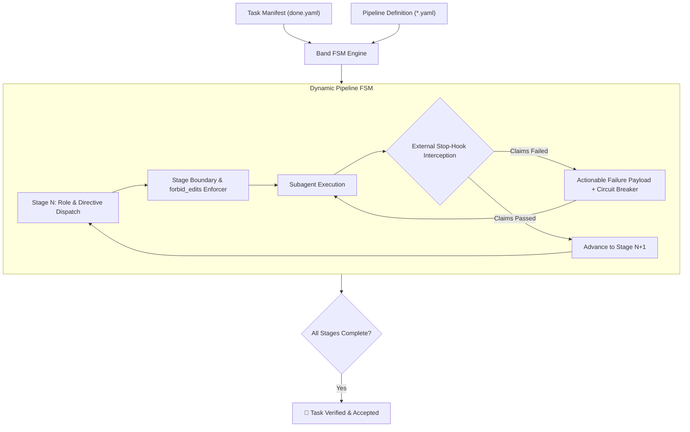

# 🥁 Band

> **Declarative, Claims-Driven Agent Harness & FSM State Machine for Autonomous Software Engineering.**

`Band` is a lightweight, zero-dependency execution harness and external verification engine. It drives AI agents through arbitrary, declarative multi-stage pipelines (TDD, mutation analysis, adversarial audits, multi-tier quality gates) with deterministic state machines and external Stop-hook enforcement.



## 🧠 Scientific Grounding & Theoretical Foundation

Autonomous LLM agents deployed on real-world codebases exhibit predictable, mathematically well-documented failure modes when left unconstrained. `Band` was designed around findings from state-of-the-art software engineering and AI research:

### 1. Inability of LLMs to Self-Correct Without Deterministic Oracles
* **Research:** [*Huang et al. (2023), "Large Language Models Cannot Self-Correct in Reasoning Tasks without External Feedback"*, arXiv:2310.01798](https://arxiv.org/abs/2310.01798); [*Shinn et al. (2023), "Reflexion: Language Agents with Verbal Reinforcement Learning"*, NeurIPS](https://arxiv.org/abs/2303.11366).
* **The Problem:** LLMs cannot reliably self-evaluate their own generated code through pure intrinsic reflection; they experience confirmation bias and falsely declare broken solutions correct.
* **Band Solution:** Band introduces an external, deterministic oracle layer (`Stop` hooks executing real compilers, linters, test harnesses, and typecheckers) that intercepts premature exit attempts and feeds back exact execution traces.

### 2. Phase Contamination & Test Modification Gaming
* **Research:** [*Jimenez et al. (2024), "SWE-bench: Can Language Models Resolve Real-World GitHub Issues?"*, ICLR](https://arxiv.org/abs/2310.06770).
* **The Problem:** In monolithic prompts, agents "game" test suites by weakening assertions, deleting failing tests, or tailoring tests to match incorrect implementations.
* **Band Solution:** Git-level `forbid_edits` boundaries per stage. A Test Author agent is isolated to test files, while an Implementer agent is forbidden from editing test files during the Green phase.

### 3. Role Specialization & Standard Operating Procedures (SOP)
* **Research:** [*Hong et al. (2023), "MetaGPT: Meta Programming for Multi-Agent Collaborative Framework"*, ICLR 2024](https://arxiv.org/abs/2308.00352); [*Wu et al. (2023), "AutoGen: Enabling Next-Gen LLM Applications"*](https://arxiv.org/abs/2308.08155).
* **The Problem:** Monolithic single-agent contexts become overloaded, degrading reasoning quality and losing track of non-functional invariants.
* **Band Solution:** Explicit multi-agent decomposition where each stage defines a specialized role (`Test Author`, `Code Implementer`, `Mutation Runner`, `Adversarial Reviewer`, `Gatekeeper`) with minimal, scoped context.

### 4. Mutation Testing as an Empirical Adequacy Criterion
* **Research:** [*Jia & Harman (2011), "An Analysis and Survey of the Development of Mutation Testing"*, IEEE TSE](https://ieeexplore.ieee.org/document/5487526).
* **The Problem:** High test coverage frequently hides vacuous assertions where tests run code without verifying critical business invariants.
* **Band Solution:** First-class `mutation` claim adapter running diff-scoped mutation testing (e.g., Stryker/PIT) to prove test suites actively catch logic mutations before code is accepted.

## ⚙️ How It Works

Band is **completely generic and data-driven**. The engine contains zero hardcoded stage names, package paths, or project-specific logic.

1. **Declarative Pipelines (`pipelines/*.yaml`):** Define any arbitrary sequence of stages, permitted/forbidden file patterns, and claims to evaluate.
2. **Task Manifests (`done.yaml`):** Declare the target package, the desired pipeline profile, and acceptance claims (`make`, `mutation`, `critic`, `hygiene`).
3. **External Stop-Hook:** Registered in `hooks.json`. When an agent attempts to stop or declare completion, the hook runs `python3 -m band --hook`, verifying that all claims for the active stage are green.
4. **Circuit Breaker:** Prevents infinite hallucination loops by tripping if the exact same failure repeats across consecutive attempts.
5. **Zero External Dependencies:** Built on the Python 3 standard library (`subprocess`, `json`, `hashlib`, `unittest`). No external daemons, servers, or packages needed.

## 🚀 Quickstart in Any Repository

Install `Band` into the root of any repository:

```bash
curl -fsSL https://raw.githubusercontent.com/jiva-studio/band/main/install.sh | bash
```

This installs the clean `.agents/` structure:

```text
.agents/
├── hooks.json             # Stop-hook configuration
├── pipelines/             # Declarative pipeline definitions (standard, hardened, fast, docs)
├── band/                  # Python FSM verification engine & zero-dependency YAML loader
├── skills/                # Agent skills (/band, /spec, /intent, /coder)
└── tasks/                 # Task folders with done.yaml specifications
```

## 📦 Defining Pipelines & Task Manifests

### 1. Custom Pipeline Definition (`pipelines/my-pipeline.yaml`)

```yaml
name: my-pipeline
description: "Custom pipeline for services"
stages:
  - id: unit-tests
    role: "Test Engineer"
    directive: "Write unit tests for the module."
    forbid_edits: ["src/**"]
    claims:
      - id: tests-fail
        tool: make
        target: test
        expect: "red"

  - id: implementation
    role: "Backend Engineer"
    directive: "Implement feature to pass unit tests."
    forbid_edits: ["tests/**"]
    claims:
      - id: tests-pass
        tool: make
        target: test
        expect_exit: 0

  - id: gatekeeper
    role: "Quality Gatekeeper"
    directive: "Run final verification."
    claims: []
```

### 2. Task Specification (`.agents/tasks/<slug>/done.yaml`)

```yaml
slug: feat-user-auth
target: "services/auth"
pipeline: "my-pipeline"

claims:
  - id: l1-build
    kind: make
    target: check-package
    params:
      PKG: "@services/auth"

  - id: l2-mutation
    kind: mutation
    target: "@services/auth"
    mode: diff

  - id: l3-critic
    kind: critic
    checks:
      - "No unhandled nulls or security bypasses"
      - "Follows intent.md non-goals"

  - id: l4-hygiene
    kind: hygiene
    no_stubs: true
    no_skipped_tests: true
```

## 🕹 CLI Reference

```bash
# Start pipeline for a task
python3 -m band --start-pipeline .agents/tasks/<slug>/done.yaml

# Inspect pipeline state
python3 -m band --status .agents/tasks/<slug>/done.yaml

# Run verification claims directly
python3 -m band --spec .agents/tasks/<slug>/done.yaml

# Execute Stop-hook check (called automatically by agent runner)
python3 -m band --hook
```

## 🧪 Self-Tests

```bash
make check
make self-test
```

## 📄 License

MIT © [Jiva Studio](https://github.com/jiva-studio)
