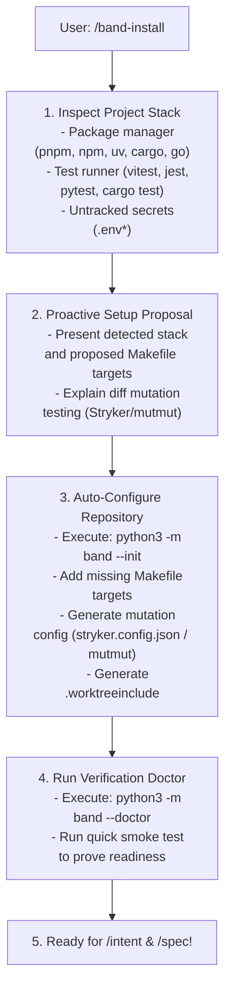

# Band Install & Smart Setup (`/band-install`)

The `/band-install` skill is an **interactive onboarding and repository configuration assistant**. It eliminates manual setup friction by detecting the repository's technology stack and auto-scaffolding deterministic verification targets (`check-package`, `mutate-diff`, `setup`, `.worktreeinclude`).



---

## Step 1: Scan Repository & Stack

Before modifying any files, analyze the repository layout:
1. Identify primary language and package manager:
   - TypeScript/JavaScript: `package.json`, `pnpm-lock.yaml`, `tsconfig.json`
   - Python: `pyproject.toml`, `requirements.txt`, `uv.lock`
   - Rust: `Cargo.toml`
   - Go: `go.mod`
2. Check existing `Makefile` targets (`check-package`, `mutate-diff`, `setup`).
3. Check for untracked environment files (`.env`, `.env.local`, `.env.development`).

---

## Step 2: Propose Configuration to User

Summarize findings and explain the verification capabilities:
> *"I inspected your repository and detected **TypeScript + Vitest (pnpm)**.*
> *I can configure your project with:*
> 1. *Standard verification targets in `Makefile` (`check-package`, `mutate-diff`, `setup`)*
> 2. *Fast diff-based mutation testing via Stryker (`stryker.config.json`)*
> 3. *Worktree configuration (`.worktreeinclude`) to carry over local `.env` files*
> 4. *Band deterministic verification gates in `.agents/hooks.json`"*

---

## Step 3: Run Auto-Setup

Execute the automated setup command:
```bash
python3 -m band --init
```

This will automatically:
- Create or safely append verification targets to `Makefile`.
- Generate minimal mutation configuration tailored for diff analysis.
- Create `.worktreeinclude` with existing `.env` patterns.
- Ensure `.agents/worktrees/` is in `.gitignore`.
- Register `.agents/hooks.json`.

---

## Step 4: Validate Setup via Doctor

Run the health check:
```bash
python3 -m band --doctor
```

Confirm all checks pass:
- ✅ Git & Worktree capability
- ✅ Stack & Test Runner
- ✅ Makefile targets
- ✅ Mutation Engine
- ✅ Security Guard & Hooks

---

## Step 5: Smoke Test & Handover

Run a quick test execution to prove the toolchain is working:
```bash
make check-package
```

Inform the user:
> *"🎉 Band is 100% configured and verified for your repository! You are ready to start tasks with `/intent <task-slug>`."*
