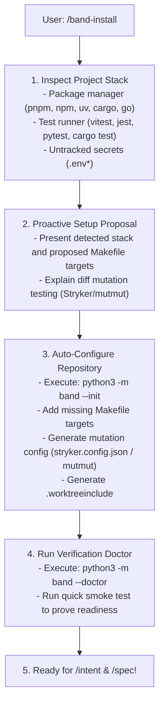

# Band Install & Smart Setup (`/band-install`)

The `/band-install` skill is an **interactive onboarding and repository configuration assistant**. It eliminates manual setup friction by detecting the repository's technology stack and auto-scaffolding deterministic verification targets (`check-package`, `mutate-diff`, `setup`, `.worktreeinclude`).



---

## Step 1: Scan Repository & Stack

Before modifying any files, analyze the repository layout:
1. Identify primary language and package manager:
   - TypeScript/JavaScript: `package.json`, `pnpm-lock.yaml`, `tsconfig.json`
   - Python: `pyproject.toml`, `requirements.txt`, `uv.lock`
   - Rust: `Cargo.toml`
   - Go: `go.mod`
2. Check existing `Makefile` targets (`check-package`, `mutate-diff`, `setup`).
3. Check for untracked environment files (`.env`, `.env.local`, `.env.development`).

---

---

## Step 2: Formulate & Propose Tailored Configuration Plan

Do NOT rely on rigid assumptions. Reason about the actual build scripts and toolchains present in the repository (e.g. Turbo, Nx, Vitest, Jest, Pytest, Cargo, Go, Mix, Gradle, Deno, Bun).

Formulate a concise plan for the user:
> *"I analyzed your codebase and discovered your project setup:*
> - *Primary Stack: [e.g. Next.js 14 / TypeScript with pnpm and Vitest]*
> - *Existing Test Commands: [e.g. `pnpm test`]*
> 
> *Here is the tailored configuration I propose:*
> 1. *Add standard declarative targets to `Makefile`:*
>    - `check-package` -> runs the test suite for a package/target.
>    - `mutate-diff` -> executes fast diff mutation testing on modified code.
>    - `setup` -> installs or synchronizes project dependencies.
> 2. *Configure diff-based mutation testing tailored for your test framework.*
> 3. *Set up `.worktreeinclude` to carry over your local environment files.*
> 4. *Register Band deterministic verification hooks in `.agents/hooks.json`.*
> 
> *Proceed with this configuration?"*

---

## Step 3: Scaffold & Configure Repository

1. Initialize base Band plumbing:
   ```bash
   python3 -m band --init
   ```
2. Tailor `Makefile` targets to match the project's real package manager, mono-repo layout, and test commands.
3. If the project supports mutation testing (e.g. Stryker for JS/TS, mutmut for Python, cargo-mutants for Rust), configure a minimal configuration file or command.
4. Ensure `.worktreeinclude` contains all local `.env*` or secret patterns.

---

## Step 4: Validate Setup via Doctor

Run the health check:
```bash
python3 -m band --doctor
```

Confirm all checks pass:
- ✅ Git & Worktree capability
- ✅ Stack & Test Runner
- ✅ Makefile targets
- ✅ Mutation Engine
- ✅ Security Guard & Hooks

---

## Step 5: Smoke Test & Handover

Run a quick test execution to prove the toolchain is working:
```bash
make check-package
```

Inform the user:
> *"🎉 Band is 100% configured and verified for your repository! You are ready to start tasks with `/intent <task-slug>`."*
